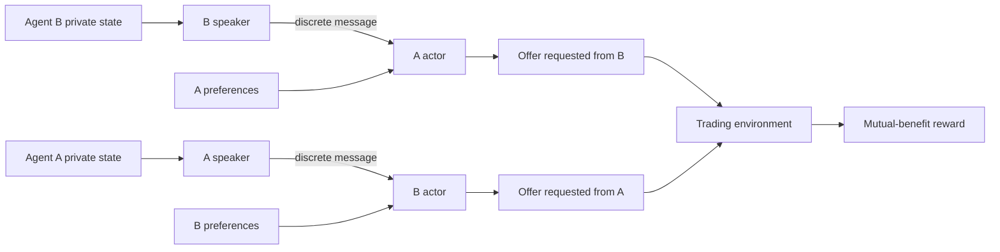

# Emergent Trading Language

[](https://www.python.org/)
[](https://pytorch.org/)
[](https://github.com/RAUNAK-733/emergent-trading-language/actions/workflows/ci.yml)
[](#current-results)
[](LICENSE)

A research prototype for studying **emergent communication in cooperative multi-agent reinforcement learning**. Two neural agents exchange discrete symbols and negotiate resource trades while holding private inventories and utility preferences.

The central question is not simply whether agents can trade. It is:

> Does communication causally improve coordination when agents possess private information?

## Why This Project Matters

High trade success alone can be misleading. Agents may discover a fixed safe strategy without using their messages at all. This project therefore evaluates learned agents against communication-control conditions:

- **Normal messages**: agents receive the symbols produced by their partner.
- **Zero messages**: the communication channel is removed.
- **Random messages**: meaningful symbols are replaced with noise.
- **Blind random baseline**: offers are sampled without observing the other agent.

A learned protocol is considered useful only when normal-message performance clearly exceeds these controls.

## Current Results

The previous environment produced high valid-trade rates but almost no measurable communication advantage:

| Evaluation mode | Efficiency |
|---|---:|
| Normal messages | 0.367 |
| Zero messages | 0.361 |
| Random messages | 0.365 |
| Blind random baseline | 0.092 |

**Finding:** agents learned a trading policy, but meaningful communication was not proven.

The latest environment addresses this by:

- charging agents for resources they give away;
- accepting only mutually beneficial trades;
- exposing full private state to the speaker;
- exposing only preferences and received messages to the actor;
- training with dense welfare, fairness, and affordability signals;
- retaining strict message-ablation tests for final evaluation.

Fresh experiments are required because these changes alter the environment and model architecture.

## System Design



Each agent contains two policies:

1. **Speaker policy**: observes the agent's private inventory and preferences, then emits discrete symbols using straight-through Gumbel-Softmax.
2. **Actor policy**: observes its own preferences and the partner's message, then samples a discrete resource offer.

The restricted actor observation creates an information bottleneck: inventory information must travel through the communication channel.

## Repository Structure

```text
agents/
  agent.py              Stochastic speaker and actor neural policies
analysis/
  verify.py             Message-ablation tests and visualizations
  entropy.py            Planned positional entropy analysis
  probing.py            Planned linear-probe analysis
  topsim.py             Planned topographic similarity analysis
  umap_viz.py           Planned representation visualization
env/
  trading_env.py        Private-state resource-trading environment
  baseline.py           Blind random baseline
training/
  train.py              Batched policy-gradient training loop
  curriculum.py         Planned curriculum scheduler
utils/
  logger.py             Planned experiment logger
main.py                 Project entry point
requirements.txt        Python dependencies
```

## Quick Start

### 1. Clone and create an environment

```bash
git clone https://github.com/RAUNAK-733/emergent-trading-language.git
cd emergent-trading-language
python -m venv .venv
```

Activate it:

```bash
# Windows PowerShell
.\.venv\Scripts\Activate.ps1

# macOS/Linux
source .venv/bin/activate
```

### 2. Install dependencies

```bash
python -m pip install -r requirements.txt
```

### 3. Run the baseline

```bash
python main.py baseline
```

### 4. Train agents

```bash
python main.py train
```

Training writes model weights and configuration to `checkpoints/`.

### 5. Verify communication

```bash
python main.py verify
```

Verification reports normal, zero-message, and random-message performance and creates:

```text
figures/communication_controls.png
figures/symbol_utility_heatmap.png
figures/symbol_inventory_heatmap.png
```

## Evaluation Metrics

| Metric | Meaning |
|---|---|
| Valid trade rate | Fraction of affordable, non-empty, mutually beneficial trades |
| Useful trade rate | Fraction of trades reaching at least 60% normalized efficiency |
| Efficiency | Joint net utility divided by estimated optimal joint utility |
| Language advantage | Normal-message efficiency minus the strongest message-control efficiency |

The strongest evidence for emergent communication is a repeatable positive language advantage across multiple random seeds.

## Research Roadmap

- [x] Private inventory and utility trading environment
- [x] Blind random baseline
- [x] Discrete speaker and actor policies
- [x] Batched policy-gradient training
- [x] Zero-message and random-message controls
- [x] Symbol-use heatmaps
- [ ] Multi-seed experiment runner
- [ ] Curriculum over resources and message bandwidth
- [ ] Positional entropy and topographic similarity
- [ ] Linear probes for message semantics
- [ ] Generalization to unseen states and larger resource spaces
- [ ] Noise, vocabulary-size, and message-length ablations

## Research Integrity

This repository intentionally distinguishes:

- successful trading from meaningful communication;
- training performance from held-out evaluation;
- interesting patterns from causal evidence;
- preliminary results from reproducible conclusions.

Negative results are treated as useful findings rather than hidden or overstated.

## Contributing

Contributions are welcome. See [CONTRIBUTING.md](CONTRIBUTING.md) for setup, experiment, and pull-request guidance.

## License

Released under the [MIT License](LICENSE).
